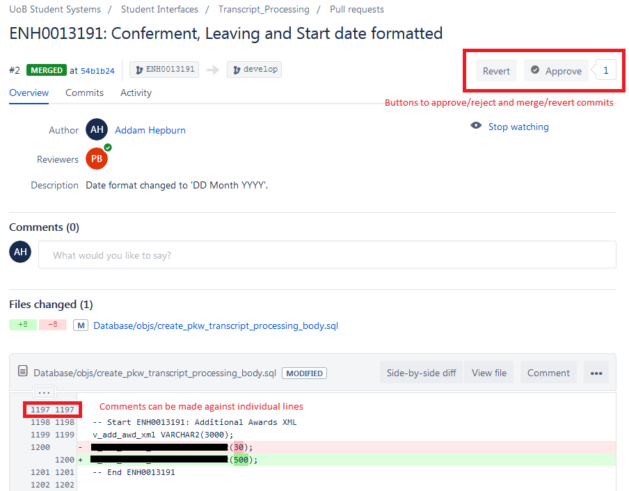

#Creating a Pull request

Once changes to a feature branch are ready for deployment to the development environment your code will need to be reviewed by a colleague. We manage this process using Bitbucket **Pull requests**. 

A full tutorial on this feature is available on the Atlassian website at [Making a Pull request](https://www.atlassian.com/git/tutorials/making-a-pull-request)

A pull request has the following stages:

1. Developer pushes code changes to Bitbucket feature branch
2. Developer creates a Pull request from their feature branch to a destination branch and allocates colleague(s) to review code.
2. Emails are sent out to reviewers
3. Code is reviewed and changes are accepted
4. Code is merged into the destination branch

Pull requests continue to exist after code is merged and can act as an audit trail of code review. 

##Create Pull request

You can create a Pull request via the Bitbucket user interface using the **Pull requests** menu item.  

When creating a new pull request you must:

1. Alter the destination to **develop**
2. Enter a description
3. Type in the name of a colleague(s) to act as code reviewer.

Once a Pull request has been approved by a reviewer your changes will be merged into the develop branch. If neccesary you can then request that artefacts be deployed to the development environment.

##Revie Code

The reviewer will receive an email containing a link to complete the code review. After logging in they are given a screen displaying code diffs for each of the changes being made, along with the ability to add comments against each line of code. 

The reviewer can choose to either approve or reject the pull request. When rejecting a pull request comments should be added to indicate the issues present as these will be visible to the original developer. After approval the code changes in the pull can be merged into the develop branch using the 'Merge' button in the top right of the screen.

##View Pull Requests

All merged pull requests that exist for a repository can be viewed from the **Pull requests** page by selecting the 'Merged' option in the active filter

