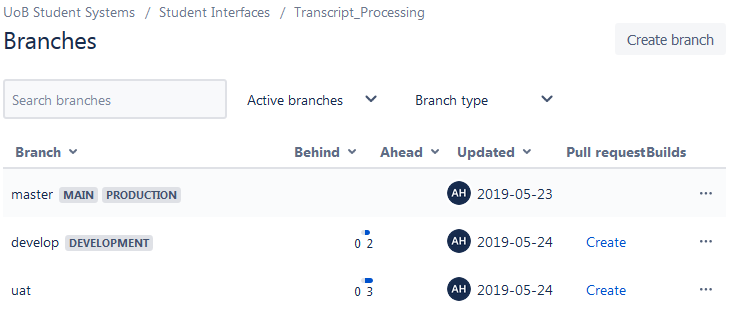

# Development Process Overview

This document contains an overview of the development process within Integration and Systems Development from work allocation through to deployment of code changes into a production environment.

The overall process is:

During this process developers will need to complete the following documents.

* <a href="Development_Team_Test_Script.dotx">A Test Script for Internal/Unit Testing</a>

* <a href="Development_Team_TCD.dotx">A TCD document detailing changes for deployment and Bitbucket Repository</a>

When broken down, the following stages are involved:

## Work Allocation and Recording Progress

* [Service Now](http://www.itservicedesk.bham.ac.uk/)
* Enhancements, Incidents and Problem Records
* Visual Task Boards
* Recording progress using Work Notes & Kanban States
	
## Making Code Changes

Source code for developments has been uploaded to GIT repositories hosted on [Bitbucket](https://www.bitbucket.org "Bitbucket Homepage"). Team members can contribute to repositories owned by the *UoB Student Systems* user. 

Changes to source code begin with the creation of a short-lived 'feature' branch off one of the long-lived branches that exist in the repository.

The following 'long-lived' branches exist in all repositories and reflect the current state of each deployment environment:

* **master** . Source code deployed to the **production environment**.
* **uat** . Source code currently deployed to the **user acceptance testing (UAT) environment**.
* **develop**. Source code currently deployed to the **development environment**

For example:

### Creating a Feature Branch

Feature branches would normally be created off **master** as we would want to take the current state of the development in production and make our changes on top of that. 

Feature branches are short-lived and are deleted once code changes have been completed, deployed to production and merged into master. They should be named after the Service Now incident, problem or enhancement record that has been created to track progress towards completion of the work. Where this isn't possible, feature branches should be given a meaningful name. 

Feature branch names should also be prefixed according to their purpose. 

* Enhancement: **feature/** ( e.g. feature/ENH0013191 )
* Incident: **hotfix/** ( e.g. hotfix/INC897900 )
* Problem **bugfix/** ( e.g. bugfix/PRB40805 )

Once created, a new feature branch can be checked out on your local machine and code changes made/committed. 

* [Source Control - creating Feature Branches & GIT Flow](../source_control)
* [Setting up Shared Key Authentication for GIT](https://confluence.atlassian.com/bitbucket/set-up-an-ssh-key-728138079.html)
* [Code Style Guides](../style_guides)

## Code Review
	
* [Creating a Bitbucket Pull request for code review](pull-request.md)
* [Code Review Checklist](../code_reviews)
* [Unit Testing](../unit_testing)

## Code Promotion

### Deployment to Development

Code changes would normally be made and tested locally, then deployed to the development environment following a code review.  In some circumstances changes may be made in the development environment before code review, for example when making database schema changes. 

### Deployment to UAT

Once your changes have passed internal review, they will be merged into the **uat** branch and deployed to the user acceptance testing environment. Your changes will then be available to the business for testing. 

### Deployment to Production

Once your changes have passed UAT and have been deployed to the production environment, your changes will be merged into the master branch. Your code changes will be prepared for release in one of two ways:

* **Where all of the changes in UAT need to be deployed to production**, the current state of the **uat** branch will be merged into the **master** branch.

* **Where only the changes in your feature branch or a combination of feature branches need to be deployed to production** a short-lived release branch will be created and merged into master. This branch will be named after the Service Now change that has been approved to move your changes live.

