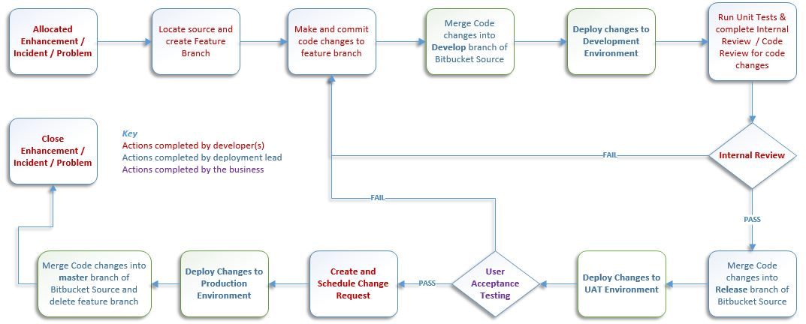

# Development Process Overview

This document contains an overview of the development process within Integration and Systems Development, from work allocation through to deployment of code changes into a production environment.

The overall process is:

During this process developers will need to complete the following documents.

* <a href="Development_Team_Test_Script.dotx">A Test Script for Internal/Unit Testing</a>

* <a href="Development_Team_TCD.dotx">A TCD document detailing changes for deployment and Bitbucket Repository</a>

When broken down, the following stages are involved:

## Work Allocation and Recording Progress

* ServiceNow 
* Enhancements, Incidents and Problem Records
* Visual Task Boards
* Recording progress using Work Notes & Kanban States
	
## Source Code Management

* Locating source code
* Branching Strategies
* GIT Repository Structure

## Changing Code
	
* Coding Styles
* Preparing code for promotion

## Code Promotion

* Internal / Unit Testing
* UAT
* Change Management / Moving Changes into Production
